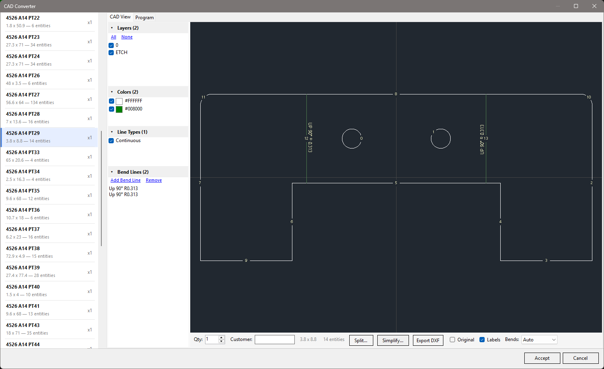
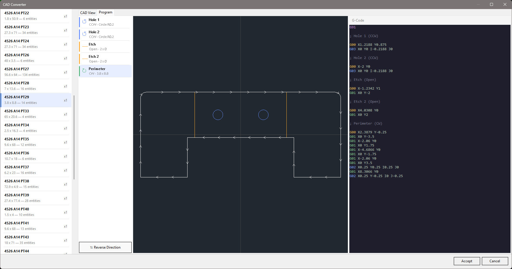

# OpenNest

A Windows desktop application for CNC nesting — imports DXF drawings, arranges parts on material plates, and exports layouts as DXF or G-code for cutting.

<p>
  <a href="screenshots/screenshot-nest-1.png"></a>
  <a href="screenshots/screenshot-nest-2.png"></a>
</p>

OpenNest takes your part drawings, lets you define your sheet (plate) sizes, and arranges the parts to make efficient use of material. The result can be exported as DXF files or post-processed into G-code that your CNC cutting machine understands.

## Features

### Import & Export

| Feature | Description |
|---------|-------------|
| **DXF/DWG Import** | Load part drawings from AutoCAD DXF or DWG files via ACadSharp |
| **DXF Export** | Export completed nest layouts back to DXF for downstream tools |
| **BOM Import** | Batch-import part lists with quantities from Excel spreadsheets |
| **Bend Line Detection** | Import bend lines from DXF via pluggable detectors (SolidWorks flat pattern built in) |
| **Built-in Shapes** | 12 parametric shapes (circles, rectangles, L/T/flange, etc.) for quick parts |

### Nesting

| Feature | Description |
|---------|-------------|
| **Pluggable Engines** | Default multi-phase, Vertical Remnant, Horizontal Remnant, plus custom plugin DLLs |
| **Fill Strategies** | Linear grid, interlocking pairs, rectangle best-fit, and extents-based tiling |
| **Best-Fit Pair Nesting** | NFP-based pair evaluation finds tight interlocking orientations between parts |
| **Gravity Compaction** | Geometry-based directional push that preserves part spacing, including rotated parts and near passes between outlines |
| **Part Rotation** | Automatic angle sweep to find better fits across allowed orientations |
| **Multi-Plate Support** | Manage multiple plates of different sizes and materials in one nest |

### Plate Operations

| Feature | Description |
|---------|-------------|
| **Sheet Cut-Offs** | Auto-generated trim cuts with geometry-aware clearance around placed parts |
| **Drawing Splitting** | Split oversized parts with straight cuts, weld-gap tabs, or spike-groove joints |
| **Interactive Editing** | Zoom, pan, select, clone, rotate, push, and manually arrange parts |

### CNC Output

| Feature | Description |
|---------|-------------|
| **Lead-Ins, Lead-Outs & Tabs** | Configurable approach/exit paths and holding tabs with snap placement |
| **Contour & Program Editing** | Inline G-code editor with contour reordering and cut-direction reversal |
| **User-Defined Variables** | Named G-code variables (`$name`) emitted as machine variables (`#200+`) at post time |
| **Post-Processors** | Plugin-based G-code generation; Cincinnati CL-707/800/900/940/CLX included |

## Prerequisites

- **Windows 10 or later**
- [.NET 8 SDK](https://dotnet.microsoft.com/download/dotnet/8.0)

## Getting Started

### Build

```bash
git clone https://github.com/ajisaacs/OpenNest.git
cd OpenNest
dotnet build OpenNest.sln
```

### Cross-platform engine contract tests

```bash
dotnet test OpenNest.Engine.Tests/OpenNest.Engine.Tests.csproj
```

`OpenNest.Engine.Tests` targets `net8.0` and runs on Linux, macOS, and Windows without the desktop project or local DXF fixtures. The existing `OpenNest.Tests` suite still requires Windows.

The new whole-job contracts in `OpenNest.Engine/Jobs` (`namespace OpenNest`) use owned immutable geometry/settings, explicit part IDs and positive demand, finite or unlimited stock (`null` means unlimited; zero means unavailable), and result ID/pose values rather than mutable desktop models. Callers own their inputs: the job copies everything at entry and the result leaks no mutable `Drawing`, `Plate`, or `NestItem`. One job is one material/thickness/unit system — no cross-material pooling. Rotation is in radians about the geometry origin, followed by translation into the plate quadrant frame. Strategy factories belong to each runner, not the global registry. In the public API, the legacy `SheetSize` request field is the unlimited-stock fallback only when `Plates` is null; an explicit empty `Plates` list means no available stock.

`NestJobRunner.Solve` allocates a job across physical sheets from the full stock inventory: every available stock entry is trialled independently each iteration, and only the winning candidate consumes a sheet or reduces demand. Selection is a documented deterministic greedy policy — lexicographic placed-count vector by ascending part priority, then lower consumed sheet area, then smaller placement envelope, then original stock input order (see `NestJobCandidateComparer`). It is a tie policy, not a guarantee of global-minimum material or plate count. Finite stock is never exceeded; `MaxPlates` caps sheet count; empty parts complete without consuming stock; empty or fully exhausted stock returns `Incomplete/StockExhausted`; a zero-placement candidate stops with `NoPlacementFound` and consumes no sheet.

`DrawingJobMapper` snapshots caller drawings/items under explicit requirement IDs. `LegacyPlateNesterAdapter` creates fresh private legacy drawings, items, and plates for each trial and maps returned drawings **by reference**, never by name. Mutable legacy quantities never drive the fulfillment ledger. `PlateNesterFactory` resolves the built-in strategy names (`Default`, `Strip`, `Vertical Remnant`, `Horizontal Remnant`) to instance-scoped placement strategies; it neither reads nor changes the process-global `NestEngineRegistry`, and unknown keys reject. Quantity deduction in the engine paths the runner reaches (base-class fill/pack, strip deduction, remnant-fill ledger, shrink-leftover counting) is keyed by drawing reference, not display name, so same-name drawings and repeated requirements stay independent. `NestResultMaterializer` returns a detached domain nest and `DrawingsByPartId` identity map. Each output plate represents one physical sheet (`Quantity = 1`), and each placement is attached exactly once so domain quantity events do not double count.

```csharp
var job = new NestJob(
    new[] { DrawingJobMapper.FromDrawing("requirement-1", drawing, quantity: 3) },
    new[] { DrawingJobMapper.FromPlate("stock-1", plateTemplate, quantity: 3) });
var result = new NestJobRunner(LegacyPlateNesterAdapter.Create).Solve(job);
var domainResult = NestResultMaterializer.Materialize(job, result);
// result contains fulfillment/unplaced counts and physical stock usage;
// domainResult.Nest and domainResult.DrawingsByPartId are detached from caller objects.
```

**Safety gate:** before the runner commits any candidate, `NestJobPlacementValidator` re-checks it against the immutable job geometry: closed usable contours, finite poses, the requirement's rotation policy (automatic / fixed / bounded sweep with step), containment inside the per-quadrant usable work area, hole-aware material overlap, and required part spacing (touching is allowed at zero spacing, rejected at positive spacing). Malformed engine output fails explicitly without consuming stock or demand. Cancellation throws `OperationCanceledException` before each trial and immediately after each engine return; no half-committed state is returned. An `Incomplete` result means the heuristic stopped, not that the geometry is impossible — the stop reason says why. Geometry snapshots preserve flat CNC rapid/line/arc programs, including origin and hole contours, without approximation; other instructions are explicitly rejected.

**Placement strategies:** `Default` and `Strip` are migrated built-ins (`OpenNest.Engine/Jobs/Placement/DefaultPlateNester.cs`, `StripPlateNester.cs`) that reuse the engine geometry while keeping demand read-only; the remnant strategies still run through `LegacyPlateNesterAdapter` during rollout. A runnable end-to-end example — multiple requirements, mixed finite/unlimited stock, full plate/leftover enumeration — lives in `OpenNest.Engine.Tests/Jobs/NestJobExampleTests.cs`.

**Legacy caller boundaries (not yet migrated):** the desktop UI (`MainForm.RunAutoNestAsync` / `NestSinglePlateAsync`), the CLI (`OpenNest.Console`), and MCP (`NestingTools`) still call the old single-plate `engine.Nest(...)` entry points unchanged. UI adoption needs a separate adapter preserving populated-plate editing, preview routing, and Accept-versus-Cancel semantics. The public API (`OpenNest.Api`, `NestRunner.RunAsync`) already delegates to one `NestJobRunner.Solve` call and reports status, stop reason, part fulfillment, stock usage, and plate-to-stock mapping; `.nestquote` archives carry a schema version and round-trip incomplete jobs.

### Run

```bash
dotnet run --project OpenNest/OpenNest.csproj
```

Or open `OpenNest.sln` in Visual Studio and run the `OpenNest` project.

### Quick Walkthrough

1. **Create a nest** — File > New Nest
2. **Add drawings** — Import DXF files via the CAD Converter (handles bend detection, layer filtering, and color/linetype exclusion) or create built-in shapes
3. **Set up a plate** — Define the plate size, material, quadrant, and spacing
4. **Fill the plate** — The nesting engine arranges parts automatically using the active fill strategy
5. **Add cut-offs** — Optionally add horizontal/vertical cut-off lines to trim unused plate material
6. **Export** — Save as a `.nest` file, export to DXF, or post-process to G-code

### CAD Converter

The CAD Converter turns DXF/DWG files into nest-ready drawings. Detected bend notes replace their original CAD annotations in the preview, avoiding duplicate labels without hiding unrelated text. Toggle layers, colors, and linetypes to exclude construction geometry; review detected bend lines; and preview the generated cut program with contour ordering before accepting the drawing into the nest.

<p>
  <a href="screenshots/screenshot-cad-converter-1.png"></a>
  <a href="screenshots/screenshot-cad-converter-2.png"></a>
</p>

## Command-Line Interface

OpenNest includes a CLI for batch nesting without the GUI — useful for automation, scripting, and CI pipelines.

```bash
dotnet run --project OpenNest.Console/OpenNest.Console.csproj -- <input-files> [options]
```

**Import DXF files and nest onto a plate:**

```bash
# Import a DXF and fill a 60x120 plate
dotnet run --project OpenNest.Console/OpenNest.Console.csproj -- part.dxf --size 60x120

# Import multiple DXFs with mixed-part auto-nesting (experimental)
dotnet run --project OpenNest.Console/OpenNest.Console.csproj -- part1.dxf part2.dxf --size 60x120 --autonest
```

**Work with existing nest files:**

```bash
# Re-fill an existing nest file
dotnet run --project OpenNest.Console/OpenNest.Console.csproj -- project.zip

# Add a new DXF to an existing nest and auto-nest
dotnet run --project OpenNest.Console/OpenNest.Console.csproj -- project.zip extra-part.dxf --autonest
```

**Options:**

| Option | Description |
|--------|-------------|
| `--size <WxL>` | Plate size (e.g. `60x120`). Required for DXF-only mode. |
| `--autonest` | Use mixed-part nesting instead of linear fill (experimental) |
| `--drawing <name>` | Select which drawing to fill with (default: first) |
| `--quantity <n>` | Max parts to place (default: unlimited) |
| `--spacing <value>` | Override part spacing |
| `--template <path>` | Load plate defaults (thickness, quadrant, material, spacing) from a nest file |
| `--output <path>` | Output file path (default: `<input>-result.zip`) |
| `--keep-parts` | Keep existing parts instead of clearing before fill |
| `--check-overlaps` | Run overlap detection after fill (exits with code 1 if found) |
| `--engine <name>` | Select a registered nesting engine |
| `--post <name>` | Post-process the result with the named post-processor plugin |
| `--no-save` | Skip saving the output file |
| `--no-log` | Skip writing the debug log |

## Project Structure

```
OpenNest.sln
├── OpenNest/                   # WinForms desktop application (UI)
├── OpenNest.Core/              # Domain model, geometry, and CNC primitives
├── OpenNest.Engine/            # Nesting algorithms and whole-job contracts
├── OpenNest.Engine.Tests/      # Cross-platform whole-job contract tests (net8.0)
├── OpenNest.IO/                # File I/O — DXF import/export, nest file format
├── OpenNest.Console/           # Command-line interface for batch nesting
├── OpenNest.Api/               # Programmatic nesting API (NestRunner pipeline)
├── OpenNest.Data/              # Machine configuration and cutting parameters
├── OpenNest.Gpu/               # GPU-accelerated pair evaluation (ILGPU)
├── OpenNest.Training/          # ML training data collection (SQLite + EF Core)
├── OpenNest.Mcp/               # MCP server for AI tool integration
├── OpenNest.Posts.Cincinnati/  # Cincinnati CL-707 laser post-processor plugin
└── OpenNest.Tests/             # Unit tests (xUnit)
```

| Project | What it does |
|---------|-------------|
| **OpenNest** | The app you run. WinForms MDI interface with plate viewer, drawing list, CAD converter, and dialogs. |
| **OpenNest.Console** | Command-line interface for batch nesting, scripting, and automation. |
| **OpenNest.Core** | The building blocks — parts, plates, drawings, geometry, G-code representation, bend lines, cut-offs, and drawing splitting. |
| **OpenNest.Engine** | The brains — fill strategies (linear, pairs, rect best-fit, extents), NFP-based pair evaluation, gravity compaction, and a pluggable engine registry. |
| **OpenNest.IO** | Reads and writes files — DXF/DWG (via ACadSharp), G-code, the `.nest` ZIP format, BOM spreadsheets (via ClosedXML), and bend detection from CAD files. |
| **OpenNest.Api** | High-level API for running the full nesting pipeline programmatically (import, nest, export). |
| **OpenNest.Data** | Machine configuration data layer — stores machine profiles, material/thickness parameters, lead-in/lead-out settings, and cut-off defaults. JSON-based local storage with an `IDataProvider` interface. |
| **OpenNest.Gpu** | GPU-accelerated bitmap overlap detection for best-fit pair evaluation using ILGPU. |
| **OpenNest.Posts.Cincinnati** | Post-processor plugin for Cincinnati CL-707/800/900/940/CLX laser cutting machines. Outputs Cincinnati-format G-code with material library, kerf compensation, and pierce logic. |
| **OpenNest.Mcp** | MCP (Model Context Protocol) server exposing nesting operations as tools for AI assistants. |
| **OpenNest.Tests** | 89 test files covering core geometry, fill strategies, splitting, bending, BOM import, post-processing, and the API. |

## Nesting Engines

OpenNest uses a pluggable engine architecture. The active engine can be selected at runtime.

| Engine | Description |
|--------|-------------|
| **Default** | Multi-phase strategy: linear fill, pair fill, rect best-fit, then remainder. Balances density and speed. |
| **Vertical Remnant** | Optimizes for a clean vertical drop on the right side of the plate. |
| **Horizontal Remnant** | Optimizes for a clean horizontal drop on the top of the plate. |

Custom engines can be built by subclassing `NestEngineBase` and registering via `NestEngineRegistry` or dropping a plugin DLL in the `Engines/` directory.

### Fill Strategies

Each engine composes from a set of fill strategies:

| Strategy | Description |
|----------|-------------|
| **Linear** | Grid-based fill with geometry-aware copy distance and 4-config rotation/axis optimization |
| **Pairs** | NFP-based interlocking pair evaluation — finds tight-fitting orientations between two parts |
| **Rect Best-Fit** | Greedy rectangle bin-packing with horizontal and vertical orientation trials |
| **Extents** | Extents-based pair tiling for simple rectangular arrangements |

## Drawing Splitting

Oversized parts that don't fit on a single plate can be split into smaller pieces:

- **Straight Split** — Clean cut with no joining features
- **Weld-Gap Tabs** — Rectangular tab spacers on one side for weld alignment
- **Spike-Groove** — Interlocking V-shaped spike and groove pairs for self-aligning joints

The split system supports fit-to-plate (auto-calculates split lines) and split-by-count modes, with an interactive UI for adjusting split positions and feature parameters.

**Cutout-aware clipping.** Split lines are trimmed against interior cutouts so cut paths never travel through a hole. Lines are Liang-Barsky clipped at region boundaries and arcs/circles are iteratively split at their intersections with the region box, so a cutout that straddles a split correctly contributes material to both sides. When a cutout fully spans the region between two splits, the material breaks into physically disconnected strips — the splitter detects the connected components via endpoint connectivity, nests any remaining holes inside their outer loops by bounding-box and point-in-polygon containment, and emits one drawing per strip.

## Post-Processors

Post-processors convert nested layouts into machine-specific G-code. They are loaded as plugin DLLs from the `Posts/` directory at runtime.

**Included:**

- **Cincinnati** — Full post-processor for Cincinnati CL-707/800/900/940/CLX laser cutting machines with variable declarations, material library resolution, speed classification, kerf compensation, and optional part sub-programs (M98).

Custom post-processors implement the `IPostProcessor` interface and are auto-discovered from DLLs in the `Posts/` directory.

## Keyboard Shortcuts

| Key | Action |
|-----|--------|
| `Ctrl+F` | Fill the area around the cursor with the selected drawing |
| `F` | Zoom to fit the plate view |
| `Shift` + Mouse Wheel | Rotate parts when a drawing is selected |
| `Shift` + Left Click | Push the selected group of parts to the bottom-left most point |
| Middle Mouse Click | Rotate selected parts 90 degrees |
| `X` | Push selected parts left (negative X) |
| `Shift+X` | Push selected parts right (positive X) |
| `Y` | Push selected parts down (negative Y) |
| `Shift+Y` | Push selected parts up (positive Y) |
| Arrow Keys | Nudge selected parts by an increment |
| `Shift` + Arrow Keys | Push selected parts in that direction |

## Supported Formats

| Format | Import | Export |
|--------|--------|--------|
| DXF (AutoCAD Drawing Exchange) | Yes | Yes |
| DWG (AutoCAD Drawing) | Yes | No |
| Excel BOM (Bill of Materials) | Yes | No |
| G-code | No | Yes (via post-processors) |
| `.nest` (ZIP-based project format) | Yes | Yes |

## Nest File Format

Nest files (`.nest`) are ZIP archives containing:

- `nest.json` — JSON metadata: nest info (name, customer, units, material, thickness, assist gas, salvage rate), plate defaults, plate options (alternative sizes with cost), drawings (with bend lines, material, source path, rotation constraints), and plates (size, quadrant, grain angle, parts with manual lead-in flags, cut-offs)
- `programs/program-N` — G-code text for drawing N's cut program (may include variable definitions and `$name` references)
- `programs/program-N-subs` — Sub-program definitions for drawing N (M98/G65-callable blocks for repeated features like holes)
- `entities/entities-N` — Original source entities for drawing N (preserved from DXF import with per-entity suppression state for round-trip editing)
- `bestfits/bestfit-N` — Cached best-fit pair evaluation results for drawing N, keyed by plate size and spacing (optional)

## Status

OpenNest is under active development. The core nesting workflows function end-to-end — from DXF import through filling, splitting, cut-offs, and G-code post-processing. Contributions and feedback are welcome.

## License

This project is licensed under the [MIT License](LICENSE).
