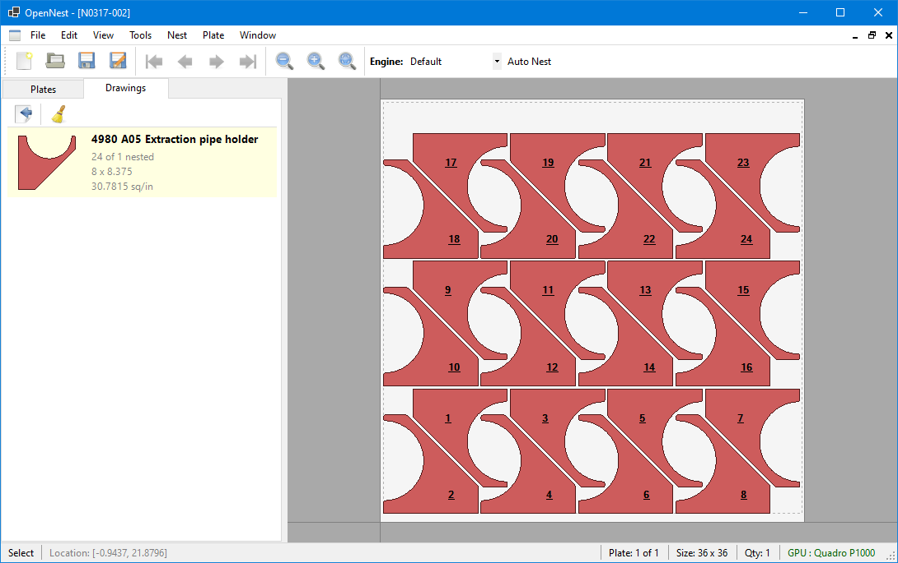
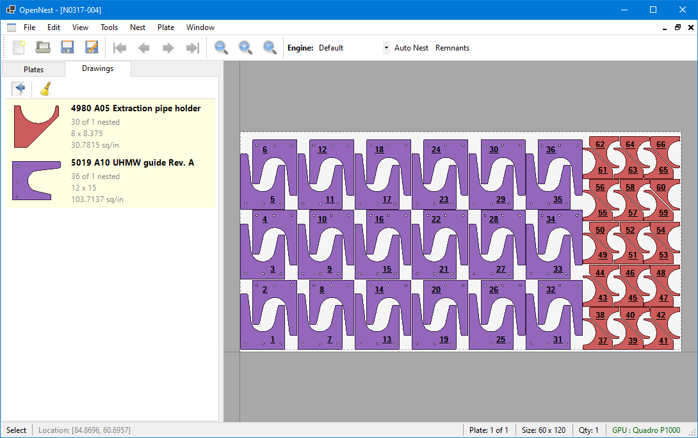

# OpenNest

A Windows desktop application for CNC nesting — imports DXF drawings, arranges parts on material plates, and exports layouts as DXF or G-code for cutting.



OpenNest takes your part drawings, lets you define your sheet (plate) sizes, and arranges the parts to make efficient use of material. The result can be exported as DXF files or post-processed into G-code that your CNC cutting machine understands.

## Features

- **DXF/DWG Import & Export** — Load part drawings from DXF or DWG files and export completed nest layouts as DXF
- **Multiple Fill Strategies** — Grid-based linear fill, interlocking pair fill, rectangle bin packing, extents-based tiling, and more via a pluggable strategy system
- **Best-Fit Pair Nesting** — NFP-based (No Fit Polygon) pair evaluation finds tight-fitting interlocking orientations between parts
- **GPU Acceleration** — Optional ILGPU-based bitmap overlap detection for faster best-fit evaluation
- **Part Rotation** — Automatically tries different rotation angles to find better fits, with optional ML-based angle prediction (ONNX)
- **Gravity Compaction** — After placing parts, pushes them together using polygon-based directional distance to close gaps between irregular shapes
- **Multi-Plate Support** — Work with multiple plates of different sizes and materials in a single nest
- **Sheet Cut-Offs** — Automatically cut the plate to size after nesting, with geometry-aware clearance that avoids placed parts
- **Drawing Splitting** — Split oversized parts into pieces that fit your plate, with straight cuts, weld-gap tabs, or interlocking spike-groove joints
- **Bend Line Detection** — Import bend lines from DXF files with pluggable detectors (SolidWorks flat pattern support built in)
- **Lead-In/Lead-Out & Tabs** — Configurable approach paths, exit paths, and holding tabs for CNC cutting
- **G-code Output** — Post-process nested layouts to G-code via plugin post-processors
- **Built-in Shapes** — 12 parametric shapes (circles, rectangles, L-shapes, T-shapes, flanges, etc.) for quick testing or simple parts
- **Interactive Editing** — Zoom, pan, select, clone, push, and manually arrange parts on the plate view
- **Pluggable Engine Architecture** — Swap between built-in nesting engines or load custom engines from plugin DLLs



## Prerequisites

- **Windows 10 or later**
- [.NET 8 SDK](https://dotnet.microsoft.com/download/dotnet/8.0)

## Getting Started

### Build

```bash
git clone https://github.com/ajisaacs/OpenNest.git
cd OpenNest
dotnet build OpenNest.sln
```

### Run

```bash
dotnet run --project OpenNest/OpenNest.csproj
```

Or open `OpenNest.sln` in Visual Studio and run the `OpenNest` project.

### Quick Walkthrough

1. **Create a nest** — File > New Nest
2. **Add drawings** — Import DXF files via the CAD Converter (handles bend detection, layer filtering, and color/linetype exclusion) or create built-in shapes
3. **Set up a plate** — Define the plate size, material, quadrant, and spacing
4. **Fill the plate** — The nesting engine arranges parts automatically using the active fill strategy
5. **Add cut-offs** — Optionally add horizontal/vertical cut-off lines to trim unused plate material
6. **Export** — Save as a `.nest` file, export to DXF, or post-process to G-code

## Command-Line Interface

OpenNest includes a CLI for batch nesting without the GUI — useful for automation, scripting, and CI pipelines.

```bash
dotnet run --project OpenNest.Console/OpenNest.Console.csproj -- <input-files> [options]
```

**Import DXF files and nest onto a plate:**

```bash
# Import a DXF and fill a 60x120 plate
dotnet run --project OpenNest.Console/OpenNest.Console.csproj -- part.dxf --size 60x120

# Import multiple DXFs with mixed-part auto-nesting (experimental)
dotnet run --project OpenNest.Console/OpenNest.Console.csproj -- part1.dxf part2.dxf --size 60x120 --autonest
```

**Work with existing nest files:**

```bash
# Re-fill an existing nest file
dotnet run --project OpenNest.Console/OpenNest.Console.csproj -- project.zip

# Add a new DXF to an existing nest and auto-nest
dotnet run --project OpenNest.Console/OpenNest.Console.csproj -- project.zip extra-part.dxf --autonest
```

**Options:**

| Option | Description |
|--------|-------------|
| `--size <WxL>` | Plate size (e.g. `60x120`). Required for DXF-only mode. |
| `--autonest` | Use mixed-part nesting instead of linear fill (experimental) |
| `--drawing <name>` | Select which drawing to fill with (default: first) |
| `--quantity <n>` | Max parts to place (default: unlimited) |
| `--spacing <value>` | Override part spacing |
| `--template <path>` | Load plate defaults (thickness, quadrant, material, spacing) from a nest file |
| `--output <path>` | Output file path (default: `<input>-result.zip`) |
| `--keep-parts` | Keep existing parts instead of clearing before fill |
| `--check-overlaps` | Run overlap detection after fill (exits with code 1 if found) |
| `--engine <name>` | Select a registered nesting engine |
| `--post <name>` | Post-process the result with the named post-processor plugin |
| `--no-save` | Skip saving the output file |
| `--no-log` | Skip writing the debug log |

## Project Structure

```
OpenNest.sln
├── OpenNest/                   # WinForms desktop application (UI)
├── OpenNest.Core/              # Domain model, geometry, and CNC primitives
├── OpenNest.Engine/            # Nesting algorithms (fill, pack, compact, best-fit)
├── OpenNest.IO/                # File I/O — DXF import/export, nest file format
├── OpenNest.Console/           # Command-line interface for batch nesting
├── OpenNest.Api/               # Programmatic nesting API (NestRunner pipeline)
├── OpenNest.Gpu/               # GPU-accelerated pair evaluation (ILGPU)
├── OpenNest.Training/          # ML training data collection (SQLite + EF Core)
├── OpenNest.Mcp/               # MCP server for AI tool integration
├── OpenNest.Posts.Cincinnati/  # Cincinnati CL-707 laser post-processor plugin
└── OpenNest.Tests/             # Unit tests (xUnit)
```

| Project | What it does |
|---------|-------------|
| **OpenNest** | The app you run. WinForms MDI interface with plate viewer, drawing list, CAD converter, and dialogs. |
| **OpenNest.Console** | Command-line interface for batch nesting, scripting, and automation. |
| **OpenNest.Core** | The building blocks — parts, plates, drawings, geometry, G-code representation, bend lines, cut-offs, and drawing splitting. |
| **OpenNest.Engine** | The brains — fill strategies (linear, pairs, rect best-fit, extents), NFP-based pair evaluation, gravity compaction, and a pluggable engine registry. |
| **OpenNest.IO** | Reads and writes files — DXF/DWG (via ACadSharp), G-code, and the `.nest` ZIP format. |
| **OpenNest.Api** | High-level API for running the full nesting pipeline programmatically (import, nest, export). |
| **OpenNest.Gpu** | GPU-accelerated bitmap overlap detection for best-fit pair evaluation using ILGPU. |
| **OpenNest.Posts.Cincinnati** | Post-processor plugin for Cincinnati CL-707/800/900/940/CLX laser cutting machines. Outputs Cincinnati-format G-code with material library, kerf compensation, and pierce logic. |
| **OpenNest.Mcp** | MCP (Model Context Protocol) server exposing nesting operations as tools for AI assistants. |
| **OpenNest.Tests** | 75+ test files covering core geometry, fill strategies, splitting, bending, post-processing, and the API. |

## Nesting Engines

OpenNest uses a pluggable engine architecture. The active engine can be selected at runtime.

| Engine | Description |
|--------|-------------|
| **Default** | Multi-phase strategy: linear fill, pair fill, rect best-fit, then remainder. Balances density and speed. |
| **Vertical Remnant** | Optimizes for a clean vertical drop on the right side of the plate. |
| **Horizontal Remnant** | Optimizes for a clean horizontal drop on the top of the plate. |

Custom engines can be built by subclassing `NestEngineBase` and registering via `NestEngineRegistry` or dropping a plugin DLL in the `Engines/` directory.

### Fill Strategies

Each engine composes from a set of fill strategies:

| Strategy | Description |
|----------|-------------|
| **Linear** | Grid-based fill with geometry-aware copy distance and 4-config rotation/axis optimization |
| **Pairs** | NFP-based interlocking pair evaluation — finds tight-fitting orientations between two parts |
| **Rect Best-Fit** | Greedy rectangle bin-packing with horizontal and vertical orientation trials |
| **Extents** | Extents-based pair tiling for simple rectangular arrangements |

## Drawing Splitting

Oversized parts that don't fit on a single plate can be split into smaller pieces:

- **Straight Split** — Clean cut with no joining features
- **Weld-Gap Tabs** — Rectangular tab spacers on one side for weld alignment
- **Spike-Groove** — Interlocking V-shaped spike and groove pairs for self-aligning joints

The split system supports fit-to-plate (auto-calculates split lines) and split-by-count modes, with an interactive UI for adjusting split positions and feature parameters.

## Post-Processors

Post-processors convert nested layouts into machine-specific G-code. They are loaded as plugin DLLs from the `Posts/` directory at runtime.

**Included:**

- **Cincinnati** — Full post-processor for Cincinnati CL-707/800/900/940/CLX laser cutting machines with variable declarations, material library resolution, speed classification, kerf compensation, and optional part sub-programs (M98).

Custom post-processors implement the `IPostProcessor` interface and are auto-discovered from DLLs in the `Posts/` directory.

## Keyboard Shortcuts

| Key | Action |
|-----|--------|
| `Ctrl+F` | Fill the area around the cursor with the selected drawing |
| `F` | Zoom to fit the plate view |
| `Shift` + Mouse Wheel | Rotate parts when a drawing is selected |
| `Shift` + Left Click | Push the selected group of parts to the bottom-left most point |
| Middle Mouse Click | Rotate selected parts 90 degrees |
| `X` | Push selected parts left (negative X) |
| `Shift+X` | Push selected parts right (positive X) |
| `Y` | Push selected parts down (negative Y) |
| `Shift+Y` | Push selected parts up (positive Y) |
| Arrow Keys | Nudge selected parts by an increment |
| `Shift` + Arrow Keys | Push selected parts in that direction |

## Supported Formats

| Format | Import | Export |
|--------|--------|--------|
| DXF (AutoCAD Drawing Exchange) | Yes | Yes |
| DWG (AutoCAD Drawing) | Yes | No |
| G-code | No | Yes (via post-processors) |
| `.nest` (ZIP-based project format) | Yes | Yes |

## Nest File Format

Nest files (`.nest`) are ZIP archives containing:

- `nest.json` — JSON metadata: nest info, plate defaults, drawings (with bend data), and plates (with parts and cut-offs)
- `programs/program-N` — G-code text for each drawing's cut program
- `bestfits/bestfit-N` — Cached best-fit pair evaluation results (optional)

## Roadmap

- **NFP-based auto-nesting** — Simulated annealing optimizer and NFP placement exist in the engine but aren't exposed as a selectable engine yet
- **Geometry simplifier** — Replace consecutive small line segments with fitted arcs to reduce program size and improve nesting performance
- **Shape library UI** — 12 built-in parametric shapes exist in code; needs a browsable library UI for quick access
- **Additional post-processors** — Plugin interface is in place; more machine-specific post-processors planned

## Status

OpenNest is under active development. The core nesting workflows function end-to-end — from DXF import through filling, splitting, cut-offs, and G-code post-processing. Contributions and feedback are welcome.

## License

This project is licensed under the [MIT License](LICENSE).
