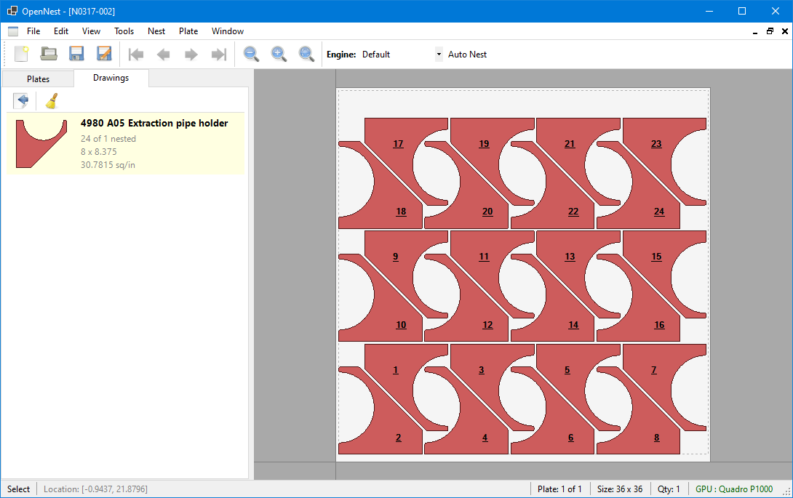
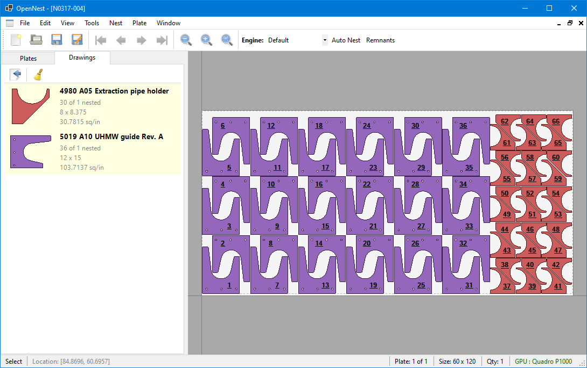

# OpenNest

A Windows desktop application for CNC nesting — imports DXF drawings, arranges parts on material plates, and exports layouts as DXF or G-code for cutting.

<p>
  <a href="screenshots/screenshot-nest-1.png"></a>
  <a href="screenshots/screenshot-nest-2.png"></a>
</p>

## Features

- **Import / export** — DXF & DWG parts (ACadSharp), Excel BOMs, bend-line detection, built-in parametric shapes; export DXF or post-processed G-code.
- **Nesting** — pluggable whole-job engines (Default, Strip, Vertical/Horizontal Remnant, StockLadder, plus DLL plugins), NFP-based interlocking pair evaluation, gravity compaction, rotation sweeps, multi-plate/multi-material jobs.
- **Plate operations** — manual sheet cut-offs, [plate- or nest-wide automatic scrap cutoffs with a minimum tail-to-keep setting](docs/automatic-scrap-cutoffs.md), oversized-part splitting (straight, weld-gap tabs, spike-groove), interactive editing, and spacing-aware pushes that can slide along or away from touching parts.
- **Visual overlap check** — highlight shared material on the active plate, rechecked automatically after edits, including containment and cutouts, with area shading, pair centroids, and hover details through View > Overlap Check. [Usage and limitations](docs/geometry/visual-overlap-check.md).
- **CNC output** — configurable lead-ins/outs and tabs, contour editing, user-defined G-code variables (`$name` → `#200+` machine variables), plugin post-processors (Cincinnati CL-707/800/900/940/CLX included). [Pre-post verification](docs/post-verification.md) checks overlaps, missing lead-ins, and rapid crossings, with explicit risk acknowledgment required to bypass warnings.

## Requirements

- Windows 10+ for the desktop app; the console, API, and most test projects build on Linux/macOS too.
- [.NET 8 SDK](https://dotnet.microsoft.com/download/dotnet/8.0) to build from source.

Windows release ZIPs are self-contained: extract the entire archive into a new folder and run `OpenNest.exe`; no separate .NET installation is needed. The Rectangles and Irregular nesting engines are built in; see [nesting engines](docs/nesting-engines.md). Use the ZIP and SHA-256 checksum from [GitHub Releases](https://github.com/ajisaacs/OpenNest/releases), not the source-code archives.

## Build, Test, Run

```bash
git clone https://github.com/ajisaacs/OpenNest.git
cd OpenNest
dotnet build OpenNest.sln                                       # full solution (Windows)
dotnet test OpenNest.Engine.Tests/OpenNest.Engine.Tests.csproj  # cross-platform engine tests
dotnet test OpenNest.Tests/OpenNest.Tests.csproj                # core/engine/IO/API tests
dotnet test OpenNest.FrontEnd.Tests/OpenNest.FrontEnd.Tests.csproj # console/MCP/API integration
dotnet run --project OpenNest/OpenNest.csproj                   # desktop app (Windows)
```

`OpenNest.WinForms.Tests` (desktop-assembly tests) runs on Windows only; CI runs it and `OpenNest.FrontEnd.Tests` on a GitHub-hosted Windows runner for every master push and pull request. Format changed files with `dotnet format OpenNest.sln --include <path>`.

Shared coding-agent guidance lives in [AGENTS.md](AGENTS.md). [CLAUDE.md](CLAUDE.md) imports it for Claude Code compatibility; make shared instruction changes in AGENTS.md, not in duplicate agent-specific copies.

### Quick start

1. File > New Nest
2. Import DXFs via the CAD Converter (layer/color filtering, bend detection, G-code preview) or create built-in shapes
3. Define plate size, material, quadrant, spacing
4. Fill — the engine arranges parts
5. Optionally add cut-off lines, apply Part Sequencing to order crossing cut-offs before their parts, then save `.nest`, export DXF, or post-process to G-code

Review part spacing before cutting, especially for interlocking pairs. See [pair-spacing checks and current limitations](docs/geometry/pair-spacing.md).

## Command-Line Interface

```bash
dotnet run --project OpenNest.Console -- part.dxf --size 60x120               # fill one plate
dotnet run --project OpenNest.Console -- part1.dxf part2.dxf --size 60x120 --autonest
dotnet run --project OpenNest.Console -- project.zip                          # re-fill a nest file
```

Key options: `--size WxL`, `--autonest` (validated single-sheet whole-job nesting), `--allow-invalid` (explicit warning override), `--engine <name>` (jobs engine or fill strategy), `--quantity`, `--spacing`, `--template <nest>`, `--output <path>`, `--check-overlaps`, `--post <name>`, `--no-save`. Run without arguments for the full list.

## Benchmarking Engines

`OpenNest.Benchmark` runs every registered `INestingEngine` against `.nest` files (or a JSON manifest of DXFs + quantities) and scores by salvage-credited sheet area, with a penalty per unplaced part.

```bash
dotnet run --project OpenNest.Benchmark -- ./benchmark-jobs \
  --sheet-sizes 48x96,60x120,72x120 --engines Irregular,Rectangles --csv results.csv
```

Layouts are validated (bounds, spacing, quantity, rotation, stock match); invalid runs place nothing and pay the penalty. `--parallel` (default 3) speeds up scoring but inflates `Time(ms)` — use `--parallel 1` when comparing speed. Pass `--sheet-sizes` for an unbiased run; otherwise only each file's original sizes are offered. `--progress` logs each solve's start, the engine's `NestJobProgress` (plate evaluations throttled to one line per 2 s, every plate commit) and its finish. Custom engines drop in as DLLs implementing `INestingEngine` (public parameterless constructor) in an `Engines/` folder next to the benchmark. Built-in engines and how to change them: [nesting engines](docs/nesting-engines.md).

## Project Structure

| Project | Purpose |
|---------|---------|
| **OpenNest** | WinForms desktop app |
| **OpenNest.Core** | Domain model, geometry, CNC primitives; [material-overlap diagnostics](docs/geometry/visual-overlap-check.md) |
| **OpenNest.Engine** | Nesting algorithms and whole-job contracts |
| **OpenNest.IO** | DXF/DWG, `.nest`, G-code, BOM I/O; CAD import |
| **OpenNest.Console** | Headless batch nesting |
| **OpenNest.Api / .Data** | Programmatic pipeline; machine & cutting-parameter data |
| **OpenNest.Gpu** | GPU-accelerated pair evaluation (ILGPU) |
| **OpenNest.Benchmark** | Head-to-head engine comparison |
| **OpenNest.Mcp** | MCP server for AI tool integration |
| **Posts/** | Post-processor plugins (Cincinnati CL / CI Fiber lasers, Gravograph IS8000) |
| **\*.Tests** | Cross-platform suites; WinForms tests are Windows-only |

## Nesting Engines

Engines implement `INestingEngine.Solve(NestJob)`. Desktop Auto Nest, console autonest, MCP autonest and the API use one independent validation pipeline for every engine, including plug-ins. Invalid layouts require an explicit decision; malformed output cannot be kept. See [automatic nesting and validation](docs/automatic-nesting.md) for caller behavior and API validation status.

| Engine | Description |
|--------|-------------|
| **Default** | Any job: runs Irregular and Rectangles and keeps the cheapest valid layout |
| **Rectangles** | Plain and near-rectangular plates: maximal-rectangles box packing |
| **Irregular** | Irregular profiles: no-fit-polygon frontier packing |
| **Fill** | Multi-phase: linear fill → pairs → rect best-fit → extents (named Default in earlier releases) |
| **Strip** | Iterative shrink-fill for mixed-drawing layouts |
| **Vertical / Horizontal Remnant** | Optimizes a clean remnant drop on one edge |
| **StockLadder** | Whole-job, stock-constrained baseline with salvage-credit ranking |

Which engine suits which jobs, renamed engine names, and the rules for changing an engine: [nesting engines](docs/nesting-engines.md).

## File Format

`.nest` files are ZIP archives containing drawing programs, metadata, plates, and placements. Saved nests retain each part's lead-ins, lead-outs, tab gaps, and locks, plus the plate's cutting settings. Changing a drawing's geometry removes obsolete cutting paths from its parts; name, quantity, and color edits preserve them. See the [file-format reference](docs/nest-file-format.md) for compatibility and recovery behavior.

## Supported Formats

| Format | Import | Export |
|--------|--------|--------|
| DXF | Yes | Yes |
| DWG | Yes | No |
| Excel BOM | Yes | No |
| G-code | No | Yes (post-processors) |
| `.nest` | Yes | Yes |

## Keyboard Shortcuts

`Ctrl+F` fill area · `F` zoom to fit · `Shift+wheel` / middle-click rotate · `X`/`Y` push · arrows nudge · `Shift+arrow` push.

## Status & License

Actively developed; core workflows run end-to-end from DXF import to G-code. Contributions welcome. MIT licensed — see [LICENSE](LICENSE).
